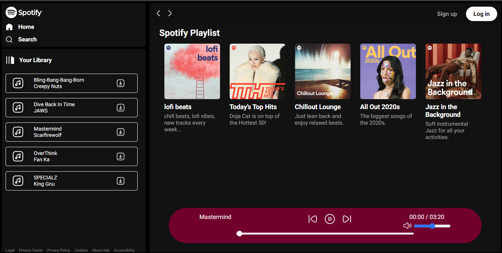

# Spotify Clone

A simple web player inspired by Spotify, allowing users to browse playlists and enjoy music.

## Features

- **Responsive Design:** The player is designed to work seamlessly across various devices, providing a consistent experience.
- **Playlist Display:** Browse through a curated list of Spotify playlists, each with its own title, image, and description.
- **Playback Controls:** Easily control playback with play, pause, previous, and next buttons.
- **Seekbar:** Visual representation of the playback progress allows users to navigate through tracks easily.
- **Volume Control:** Adjust the volume using a range input slider.
- **Dynamic Background:** The background color changes gradually to a random dark color every second for a visually engaging experience.

## Technologies Used

- **HTML5:** Markup language used for structuring the content.
- **CSS3:** Styling language used for enhancing the visual appeal and layout.
- **JavaScript:** Programming language used for implementing interactive features and functionality.

## Preview



## Demo

Check out the live demo [here](https://emo.freewebhostmost.com/).

## Getting Started

To get a local copy up and running, follow these simple steps:

1. Clone the repository:
   ```sh
   git clone https://github.com/your-username/spotify-clone.git

2. Navigate to the project directory:
    ```sh
    cd spotify-clone

3.Open index.html in your preferred web browser.

## Usage

- Click on a playlist to start playing the music.
- Use the playback controls (play, pause, previous, next) to control the music playback.
- Adjust the volume using the volume control slider.
- Click on the download button to download a song.

## Credits

- Icons sourced from [FontAwesome](https://fontawesome.com/) and [Spotify Brand Guidelines](https://developer.spotify.com/branding-guidelines/).
- Playlist images retrieved from [Spotify API](https://developer.spotify.com/documentation/web-api/).

## License

This project is licensed under the MIT License - see the [LICENSE](LICENSE) file for details.
